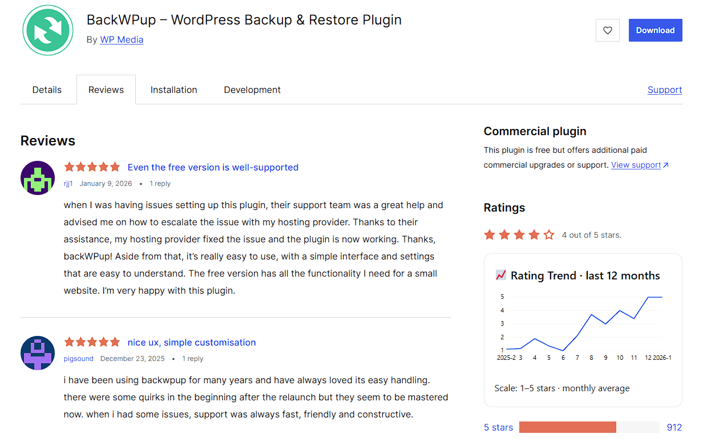

# WordPress Plugin Rating Trends

A lightweight Browser extension (for Chrome and Firefox) that adds a **rating trend chart (last 12 months)** to WordPress.org plugin pages.

It visualizes how plugin ratings evolve over time — something WordPress.org itself does not show.

---

## ✨ Features

- 📈 Rating trend chart for the **last 12 months**
- ⭐ Monthly average (1–5 stars)
- 🚫 No gaps: missing months are interpolated
- 🕒 Stops early once enough data is collected
- ⚡ Performance-optimized:
  - 🎯 Partial HTML parsing (reviews only)
  - 💾 Local cache (7 days)
- 🌍 i18n support
- 🧠 Smart fallback on localized WordPress sites
- ❌ No output if reviews are outdated

---

## 📍 Where it works

- ✅ `wordpress.org/plugins/...`
- ❌ Localized sites (e.g. `de.wordpress.org`)  
  → shows a fallback message with a link to wordpress.org

---

## 🖼 Screenshot

---

## 🔧 Installation (Chrome)

1. Clone or download this repository
2. Open Chrome and go to `chrome://extensions`
3. Enable **Developer mode**
4. Click **Load unpacked**
5. Select this project folder

## 🔧 Installation (Firefox)

1. Clone or download this repository
2. Open Firefox and go to `about:debugging`
3. Click **This Firefox**
4. Click **Load Temporary Add-on…**
5. Select the **manifest.json** file from this project folder

Done 🎉  
The chart will appear on WordPress.org plugin pages below the rating stars.

---

## 🛠 How it works (short)

- Scrapes review pages from `wordpress.org/support/plugin/{slug}/reviews/`
- Fetches only what’s needed (reviews list)
- Builds a monthly average series
- Renders a lightweight SVG chart
- Stops fetching once 12 distinct months are found

No external APIs. No tracking. No data leaves your browser.

---

## ❓ FAQ

### ❓ Why only 12 months?
Two main reasons:

1. **Performance**  
   WordPress.org does not provide an API for rating history.  
   The extension has to scrape review pages from HTML, which can become **slow** for older plugins with many reviews.

2. **Relevance**  
   Ratings from several years ago often say little about the current state of a plugin.  
   The last 12 months usually provide a **more realistic picture**.

In short: **faster, more relevant, more useful.**

---

### ❓ Why is no chart shown for some plugins?

There are two different reasons why no chart may be displayed:

**1. Too few recent ratings**  
If a plugin has received only a very small number of ratings in the last 12 months,  
the chart is replaced by a short message (“Not enough ratings to show a trend”).

**2. No recent ratings at all**  
If a plugin has not received *any* new ratings in over 12 months,  
no chart is shown at all.

Why?  
A “trend” without recent data would be misleading.  
In this case, showing nothing is better than showing a bad chart.

---

### ❓ What does “No gaps: missing months are interpolated” mean?
Some months simply have **no reviews** — that’s normal.

In those cases:
- the value is **estimated** based on the surrounding months
- the chart shows this section as a **dashed line**

Why dashed?  
👉 Because these values are **not real data points**, but calculated ones.

This keeps the chart readable without pretending false precision.

---

### ❓ What does “Smart fallback on localized WordPress sites” mean?
On localized sites like:

- `de.wordpress.org`
- `fr.wordpress.org`

the extension **cannot fetch reviews** due to browser security restrictions (CORS).

What happens instead?
- No chart is shown
- A short message appears with a **link to the English page on `wordpress.org`**
- The chart works normally there

---

### ❓ What does “Partial HTML parsing (reviews only)” mean?
The extension does **not** load full pages.

Instead, it:
- fetches only the **review listings**
- parses only the **HTML parts it actually needs**
- ignores everything else

Result:
- less data transferred
- faster loading
- lower server load

---

### ❓ What does “Stops early once enough data is collected” mean?
As soon as data for **12 distinct months** is available:
- no further pages are fetched
- even if more review pages exist

This avoids unnecessary requests and keeps things fast.

---

### ❓ What does “Not enough ratings to show a trend” mean?

If a plugin has received **fewer than 5 ratings in the last 12 months**,  
there simply isn’t enough data to identify a meaningful trend.

In this case, the chart is replaced with this message instead of showing a misleading or noisy visualization.

---

## ⚠️ Disclaimer

This extension **scrapes publicly available data** from WordPress.org.  
It is intended for **personal use and analysis**.

Not affiliated with or endorsed by WordPress.org.

---

## 📄 License

MIT
